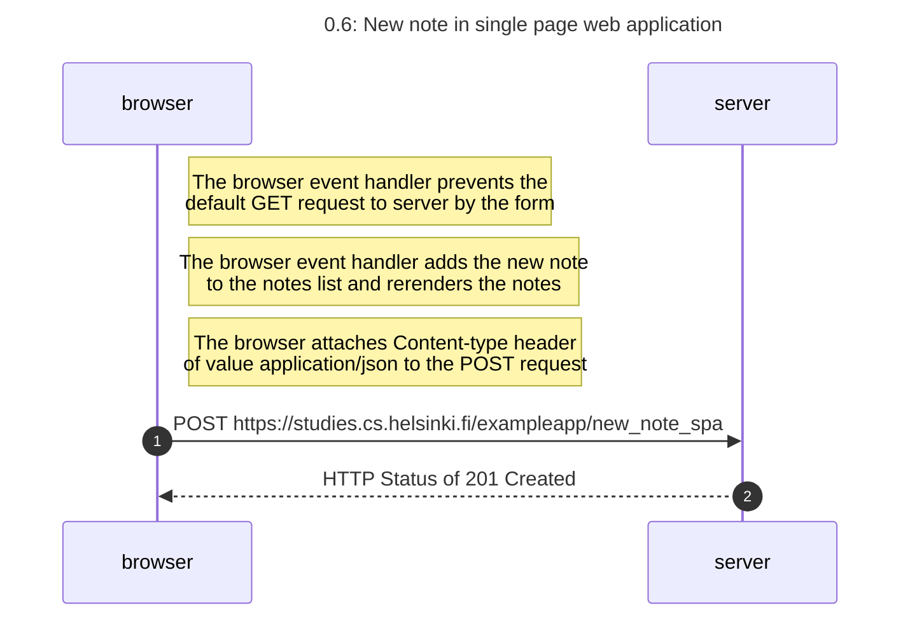
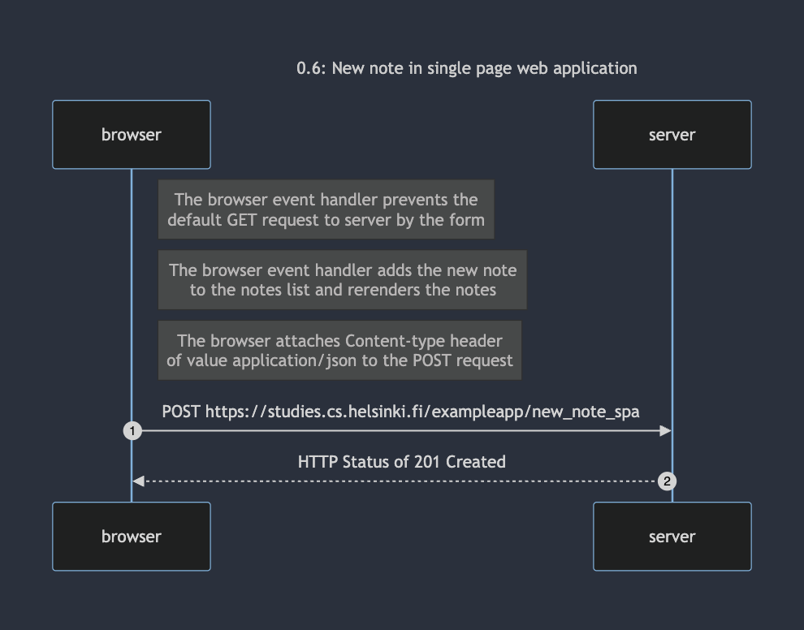

```mermaid
sequenceDiagram
  Title: 0.6: New note in single page web application
  autonumber
  participant browser
  participant server

  Note right of browser: The browser event handler prevents the <br>default GET request to server by the form
  Note right of browser: The browser event handler adds the new note <br> to the notes list and rerenders the notes
  Note right of browser: The browser attaches Content-type header <br> of value application/json to the POST request
  browser->>server: POST https://studies.cs.helsinki.fi/exampleapp/new_note_spa
  activate server
  server-->>browser: HTTP Status of 201 Created
```

